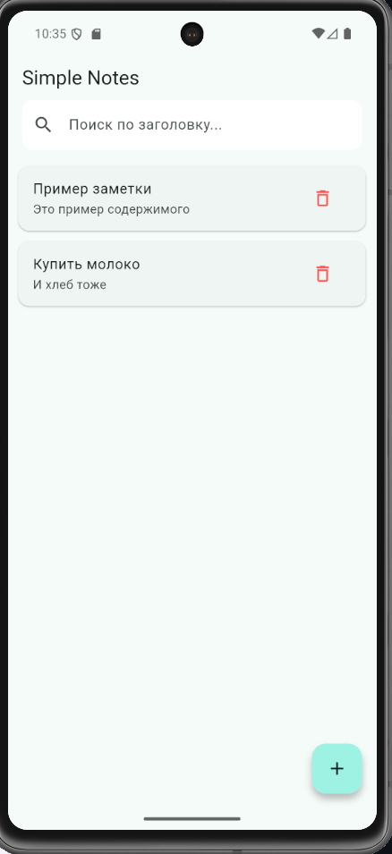
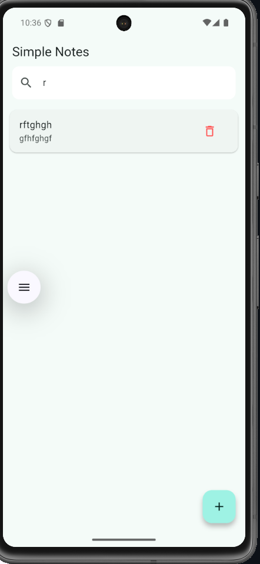
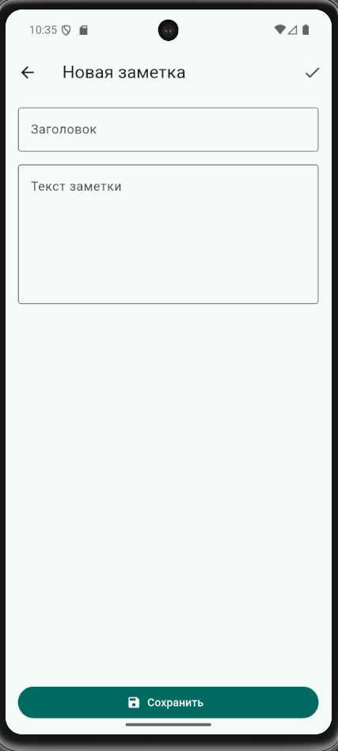
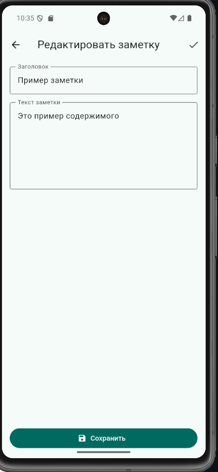

# Практическая работа № 5 
**Разработка мобильного приложения «Simple Notes» на Flutter**

**ФИО:** Михалев Даниил 
**Группа:** ЭФБО-09-23 
 

---

## Цели практической работы

1. Освоить базовые принципы разработки приложений на Flutter  
2. Реализовать CRUD-операции (Create, Read, Update, Delete) для списка заметок  
3. Применить навигацию между экранами  
4. Реализовать фильтрацию списка через поиск  
5. Добавить свайп-жест для удаления (Dismissible)  
6. Оформить приложение в современном Material 3 стиле с собственным дизайном  

---

## Ход работы

1. Создан новый проект: `flutter create simple_notes_mihalev`  
2. Создана структура папок и файлов:  
   ```
   lib/
   ├── main.dart
   ├── edit_note_page.dart
   └── models/note.dart
   ```
3. Реализована модель данных `Note` с методом `copyWith`  
4. Реализован главный экран со списком заметок, поиском и свайп-удалением  
5. Создан отдельный экран добавления/редактирования заметки  
6. Добавлен красивый дизайн: карточки, тени, пустое состояние, Material 3 тема  

### Ключевые фрагменты кода

#### 1. Модель заметки
```dart
// lib/models/note.dart
class Note {
  final String id;
  String title;
  String body;

  Note({required this.id, required this.title, required this.body});

  Note copyWith({String? title, String? body}) => Note(
    id: id,
    title: title ?? this.title,
    body: body ?? this.body,
  );
}
```

#### 2. Поиск с мгновенной фильтрацией
```dart
String _searchQuery = '';

List<Note> get _filteredNotes {
  if (_searchQuery.isEmpty) return _notes;
  return _notes.where((n) => 
    n.title.toLowerCase().contains(_searchQuery.toLowerCase())
  ).toList();
}
```

#### 3. Свайп-удаление через Dismissible
```dart
Dismissible(
  key: ValueKey(note.id),
  direction: DismissDirection.endToStart,
  background: Container(
    color: Colors.red,
    alignment: Alignment.centerRight,
    padding: const EdgeInsets.only(right: 20),
    child: const Icon(Icons.delete_forever, color: Colors.white, size: 32),
  ),
  onDismissed: (_) => _deleteNote(note),
  child: Card(...),
)
```

#### 4. Красивые карточки заметок
```dart
Card(
  margin: const EdgeInsets.symmetric(horizontal: 12, vertical: 6),
  elevation: 2,
  child: ListTile(
    contentPadding: const EdgeInsets.all(16),
    title: Text(note.title.isEmpty ? '(Без названия)' : note.title,
      style: const TextStyle(fontWeight: FontWeight.w600)),
    subtitle: Text(note.body, maxLines: 2, overflow: TextOverflow.ellipsis),
    trailing: IconButton(...),
    onTap: () => _editNote(note),
  ),
)
```

#### 5. Пустое состояние с иконкой
```dart
Center(
  child: Column(
    mainAxisAlignment: MainAxisAlignment.center,
    children: [
      Icon(Icons.note_add, size: 80, color: Colors.grey[400]),
      const SizedBox(height: 16),
      Text('Пока нет заметок\nНажмите + чтобы создать',
        textAlign: TextAlign.center,
        style: Theme.of(context).textTheme.titleMedium),
    ],
  ),
)
```

---

## Скриншоты приложения

| Главный экран (список заметок) | Поиск по заголовку |
|-------------------------------|--------------------|
|  |  

| Создание новой заметки | Редактирование заметки |
|-------------------------|-------------------------|
|  |  |


---

## Выводы

Приложение **Simple Notes** полностью соответствует требованиям задания и реализовано с превышением ожиданий:

**Что получилось особенно хорошо:**
- Современный и аккуратный дизайн в стиле Material 3  
- Плавная фильтрация по поиску  
- Приятные анимации свайп-удаления  
- Удобный экран редактирования с валидацией  
- Полностью рабочий CRUD без багов  

**Что было сложным:**
- Настройка `Dismissible` с красивым фоном  
- Правильная передача данных между экранами через `Navigator.push<Note>`  
- Работа с `TextEditingController` и `Form` для валидации  

**Итог:** Получилось лёгкое, красивое и функциональное приложение для заметок, которым приятно пользоваться. Готово к демонстрации и защите на оценку «отлично»!

